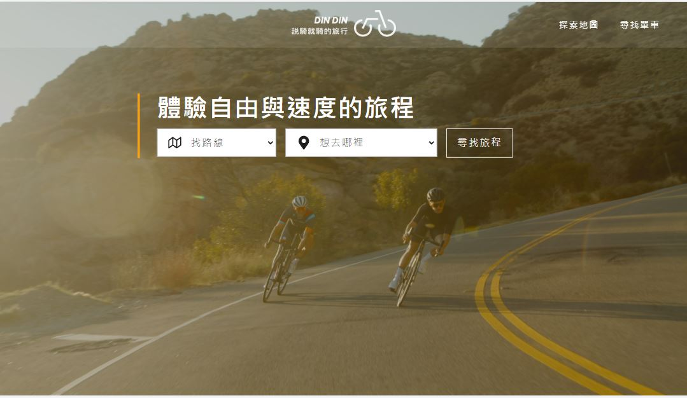
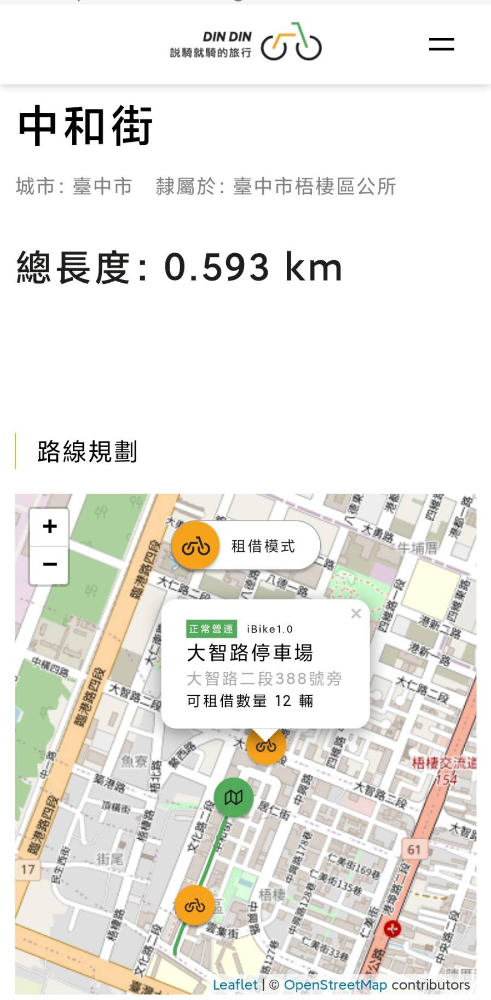

# DIN DIN Bike Tourism
[THE F2E 3rd - Week 2 - Work](https://2021.thef2e.com/news/week2)  
**UI Designer : Lola Lin**  
[UI source](https://www.figma.com/file/p1UfS4SUxqY19obZzMpcEp/Week2---%E8%87%AA%E8%A1%8C%E8%BB%8A%E5%9C%B0%E5%9C%96%E8%B3%87%E8%A8%8A%E6%95%B4%E5%90%88%E7%B6%B2)

> Tool keywords: react, leaflet, tailwind, scss, docker, openstreetmap-api


## Overview
The application is used to find nearby bikes or search bike routes.

## Requirement
+ Nodejs

## Getting started
### Download code
```sh
$ git clone https://github.com/Zhima-Mochi/DIN-DIN-bike-tourism.git
$ cd DIN-DIN-bike-tourism
$ npm install
```
### Create environment file in current file path
.env
```
REACT_APP_API_ID=FFFFFFFF-FFFF-FFFF-FFFF-FFFFFFFFFFFF
REACT_APP_API_KEY=FFFFFFFF-FFFF-FFFF-FFFF-FFFFFFFFFFFF
```
[See motc ptx api documentation.](https://motc-ptx-api-documentation.gitbook.io/motc-ptx-api-documentation/)

### Run

```sh
$ npm run start : .env
```
Now, have fun with http://localhost:3000/.

## Demo

+ [github page](https://zhima-mochi.github.io/DIN-DIN-bike-tourism/#/)
+ [virtual machine](http://108.61.187.106:8087/#/)



